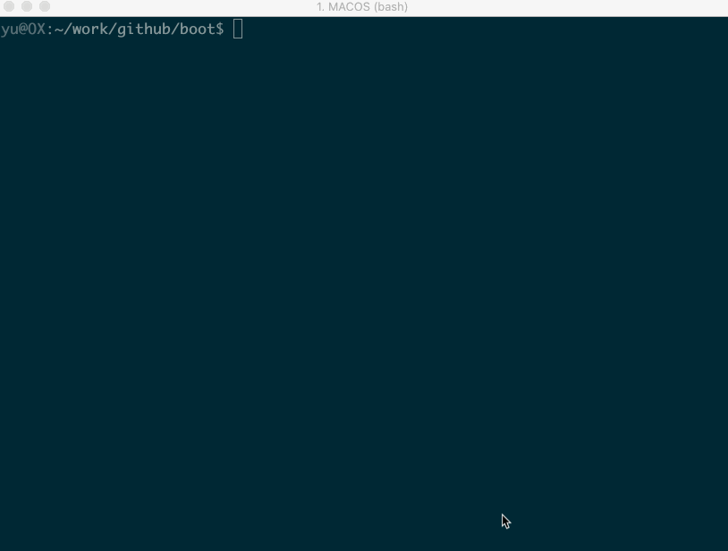

# Android_boot_image_editor
[](https://www.travis-ci.com/cfig/Android_boot_image_editor)
[](http://www.apache.org/licenses/LICENSE-2.0.html)

A tool for reverse engineering Android ROM images.

## Getting Started

#### install required packages

Mac: `brew install lz4 xz`

Linux: `sudo apt install git device-tree-compiler lz4 xz-utils zlib1g-dev openjdk-11-jdk gcc g++ python3`

Windows: Make sure you have `python3`, `JDK9+` and `openssl` properly installed.
An easy way is to install [Anaconda](https://www.anaconda.com/products/individual#windows) and [Oracle JDK 11](https://www.oracle.com/java/technologies/javase-jdk11-downloads.html), then run the program under anaconda PowerShell.

#### Parsing and packing

Put your boot.img to current directory, then start gradle 'unpack' task:

```bash
cp <original_boot_image> boot.img
./gradlew unpack
```

Your get the flattened kernel and /root filesystem under **./build/unzip\_boot**:

    build/unzip_boot/
    ├── boot.json     (boot image info)
    ├── boot.avb.json (AVB only)
    ├── kernel
    ├── second        (2nd bootloader, if exists)
    ├── dtb           (dtb, if exists)
    ├── dtbo          (dtbo, if exists)
    └── root          (extracted initramfs)

Then you can edit the actual file contents, like rootfs or kernel.
Now, pack the boot.img again

    ./gradlew pack

You get the repacked boot.img at $(CURDIR):

    boot.img.signed

Well done you did it! The last step is to star this repo :smile


### live demo
<!--  -->
<p align="center">
    
</p>

## Supported ROM image types

| Image Type      | file names                          |      |
| --------------- | ----------------------------------- | ---- |
| boot images     | boot.img, vendor_boot.img           |      |
| recovery images | recovery.img, recovery-two-step.img |      |
| vbmeta images   | vbmeta.img, vbmeta_system.img etc.  |      |
| dtbo images     | dtbo.img                            |      |

Please note that the boot.img MUST follows AOSP verified boot flow, either [Boot image signature](https://source.android.com/security/verifiedboot/verified-boot#signature_format) in VBoot 1.0 or [AVB HASH footer](https://android.googlesource.com/platform/external/avb/+/master/README.md#The-VBMeta-struct) (a.k.a. AVB) in VBoot 2.0.

## compatible devices

| Device Model                   | Manufacturer | Compatible           | Android Version          | Note |
|--------------------------------|--------------|----------------------|--------------------------|------|
| Pixel 3 (blueline)             | Google       | Y                    | 11 (RP1A.200720.009, <Br>2020)| [more ...](doc/additional_tricks.md#pixel-3-blueline) |
| Pixel 3 (blueline)             | Google       | Y                    | Q preview (qpp2.190228.023, <Br>2019)| [more ...](doc/additional_tricks.md#pixel-3-blueline) |
| Pixel XL (marlin)              | HTC          | Y                    | 9.0.0 (PPR2.180905.006, <Br>Sep 2018)| [more ...](doc/additional_tricks.md#pixel-xl-marlin) |
| K3 (CPH1955)                   | OPPO         | Y for recovery.img<Br> N for boot.img  | Pie    | [more](doc/additional_tricks.md#k3-cph1955) |
| Z18 (NX606J)                    | ZTE          | Y                    | 8.1.0                    | [more...](doc/additional_tricks.md#nx606j) |
| Nexus 9 (volantis/flounder)    | HTC          | Y(with some tricks)  | 7.1.1 (N9F27M, Oct 2017) | [tricks](doc/additional_tricks.md#tricks-for-nexus-9volantis)|
| Nexus 5x (bullhead)            | LG           | Y                    | 6.0.0_r12 (MDA89E)       |      |
| Moto X (2013) T-Mobile         | Motorola     | N                    |                          |      |
| X7 (PD1602_A_3.12.8)           | VIVO         | N                    | ?                        | [Issue 35](https://github.com/cfig/Android_boot_image_editor/issues/35) |

## more examples

* recovery.img

If you are working with recovery.img, the steps are similar:

    cp <your_recovery_image> recovery.img
    ./gradlew unpack
    ./gradlew pack

* vbmeta.img

```bash
cp <your_vbmeta_image> vbmeta.img
./gradlew unpack
./gradlew pack
```

* boot.img and vbmeta.img
```bash
cp <your_boot_image> boot.img
cp <your_vbmeta_image> vbmeta.img
./gradlew unpack
./gradlew pack
```
Your boot.img.signed and vbmeta.img.signd will be updated together.

## boot.img layout
Read [layout](doc/layout.md) of Android boot.img and vendor\_boot.img.

## References

boot\_signer
https://android.googlesource.com/platform/system/extras

cpio / fs\_config
https://android.googlesource.com/platform/system/core
https://www.kernel.org/doc/Documentation/early-userspace/buffer-format.txt

AVB
https://android.googlesource.com/platform/external/avb/

mkbootimg
https://android.googlesource.com/platform/system/tools/mkbootimg/+/refs/heads/master/

Android version list
https://source.android.com/source/build-numbers.html

kernel info extractor
https://android.googlesource.com/platform/build/+/refs/heads/master/tools/extract_kernel.py

mkdtboimg
https://android.googlesource.com/platform/system/libufdt/

libsparse
https://android.googlesource.com/platform/system/core/+/refs/heads/master/libsparse/

Android Nexus/Pixle factory images
https://developers.google.cn/android/images
